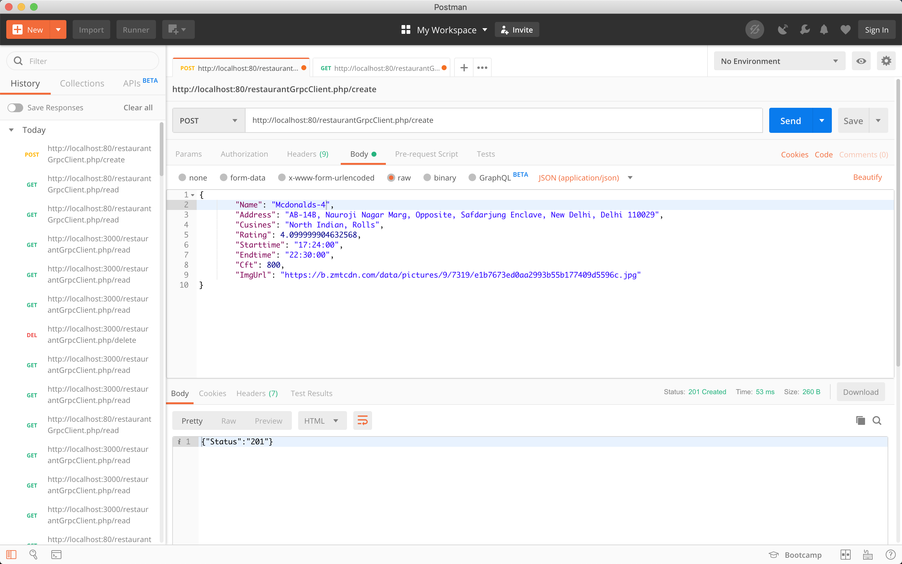
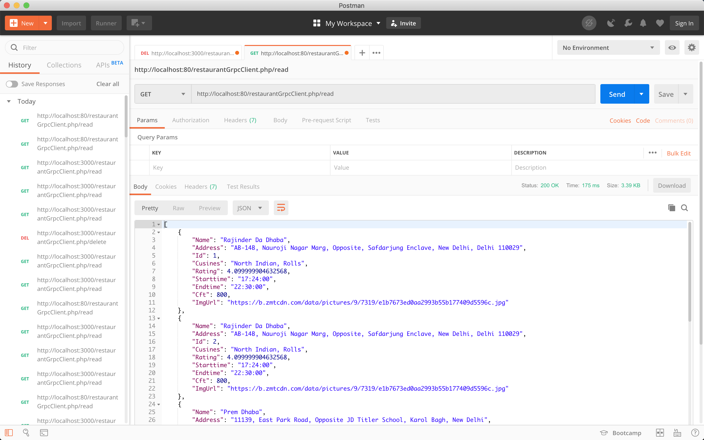
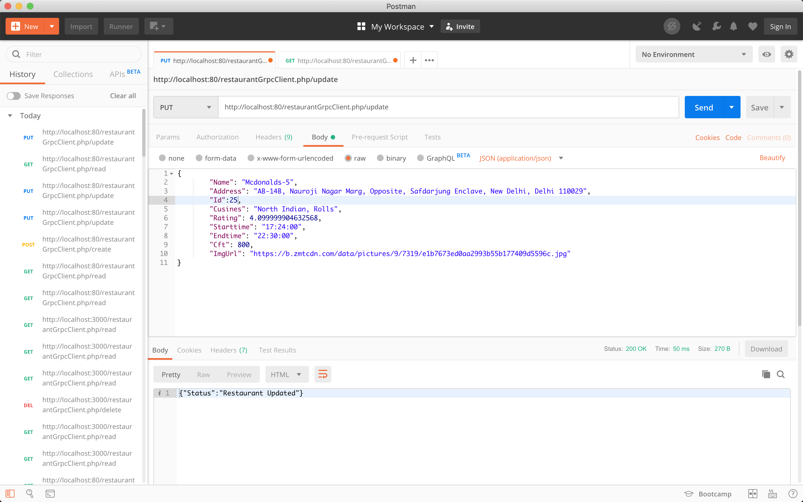
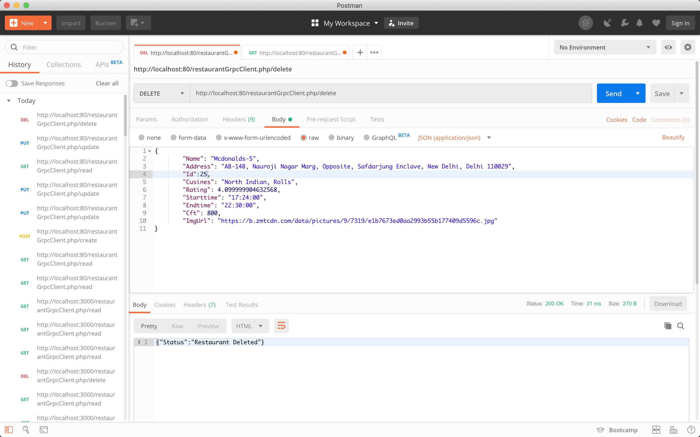

# OnboardingAssigment
## Restaurnat Menu Listing applicaton for Zomato

# In this assigment 
* A **Golang** service have been implemented which interact with databases
* A **php** client have been implemented which the interact with user and golang service
* Communication between user and PHP API having happening using RESTful API i.e HTTP + JSON
* Communication between PHP API and Golagn Service is happeing using gRPC and Protocol buffer

## Setup
* `docker-compose build`
* `docker-compose up`

## API endpoint
### 1. Create restaurant
```
POST localhost/restaurantGrpcClient.php/create
```


### 2. Get all restaurants list
```json
GET localhost/restaurantGrpcClient.php/read
```


### 3. Update restaurant
```
PUT localhost/restaurantGrpcClient.php/update
```


### 4. Deletre restaurant
```
DELETE localhost/restaurantGrpcClient.php/update
```

